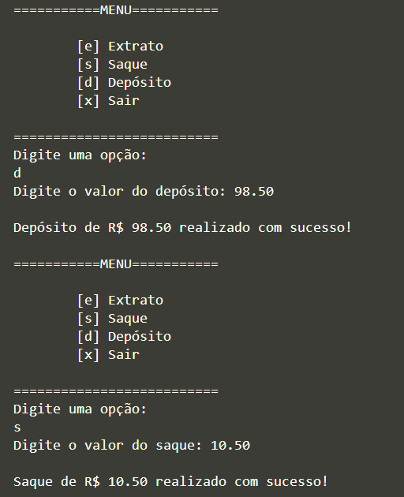
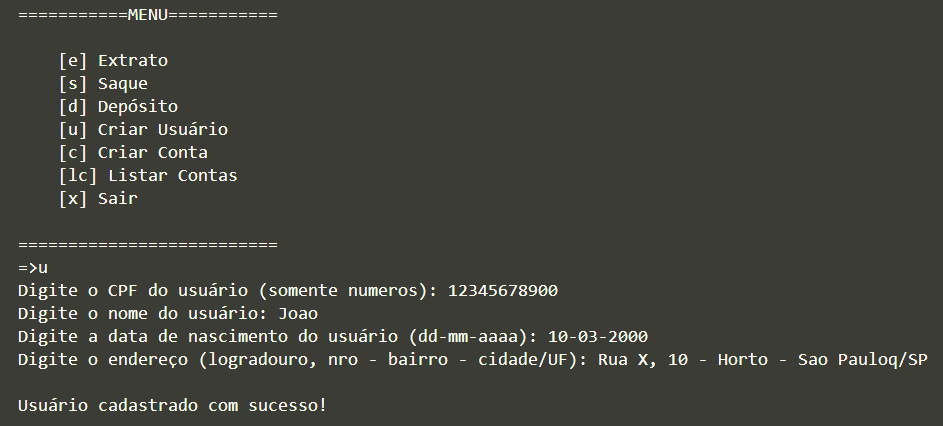

## Projeto Banco

O repositório consiste em um simples projeto da criação de um sistema bancário com 3 operações:
- Saque
- Depósito
- Extrato

O projeto fornecido pelo curso da DIO trabalha apenas com um usuário, logo não há necessidade de autenticação do mesmo. Além disso, por padrão, foi estabelecido que seriam permitidos apenas 3 operações de saque. Pela simplificade do projeto e do curso em si, não havia necessidade e não era o objetivo do projeto, utilizar interface externa, ou seja, tudo é feito pelo próprio terminal, sem a necessidade de instalação de novas bibliotecas.

## Linguagem:
- Python

## Exemplo de uso:

## Autor:

- Lucas Soares