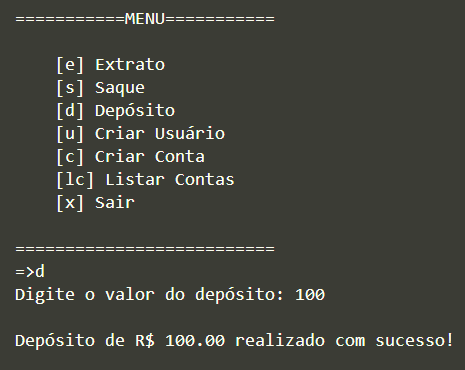

## Projeto Banco

O repositório consiste em um simples projeto da criação de um sistema bancário com as operações:
- Saque
- Depósito
- Extrato
- Criar usuário
- Criar conta
- Listar contas

O projeto fornecido pelo curso da DIO trabalha com a evolução das informações e da estrutura, conforme pode ser visto pelas mudanças no repositório. Além disso, por padrão, foi estabelecido que seriam permitidos apenas 3 operações de saque e 500 de limite. Pela simplificade do projeto e do curso em si, não havia necessidade e não era o objetivo do projeto, utilizar interface externa, ou seja, tudo é feito pelo próprio terminal, sem a necessidade de instalação de novas bibliotecas.

## Linguagem:
- Python

## Exemplo de uso:

## Autor:

- Lucas Soares